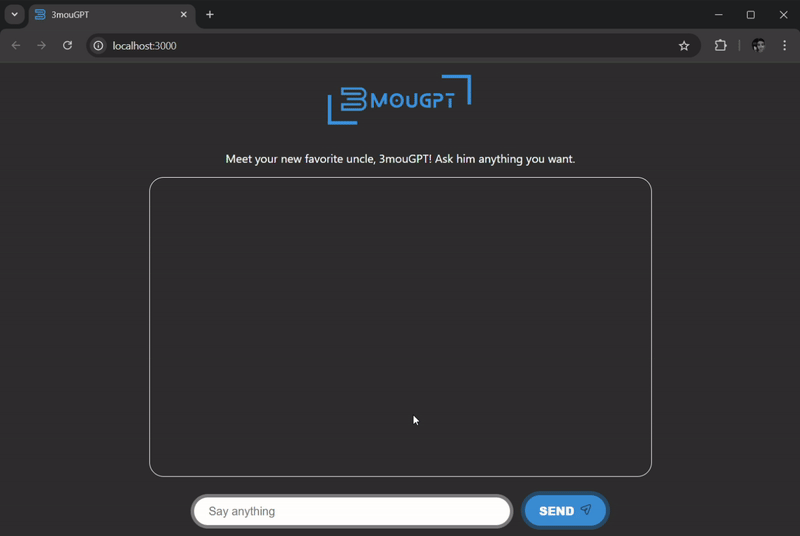

# 3mouGPT - Your Funny Arabic Uncle AI Chatbot 🤖👳🏻

Welcome to **3mouGPT**, the AI chatbot powered by OpenAI. 3mouGPT is not your average chatbot — he’s your hilarious Arabic uncle who loves to crack jokes, sprinkle in Arabic phrases, and entertain you with his witty responses. Whether you want advice, jokes, or a friendly chat, 3mouGPT has got you covered.



## About the Project

The goal of this project is to create a lighthearted and funny AI-powered chatbot for entertainment purposes. 3mouGPT is designed to act like a human, using a mix of humor and relatable Arabic uncle traits in his conversations.

This project is built using **Next.js** and leverages the power of **OpenAI GPT-3.5/4** for generating witty and engaging responses.

## Getting Started

### 1. Set Up Environment Variables

Duplicate the `.env` file into a new file named `.env.local`. Update it with your [OpenAI API key](https://platform.openai.com/api-keys).

### 2. Install Dependencies

Run this command in your terminal to install the required dependencies:

```bash
yarn
```

### 3. Start the Application

Run the following command to start the development server:

```bash
yarn dev
```

Then, open [http://localhost:3000](http://localhost:3000) in your browser to interact with 3mouGPT.

### 4. Edit the Code

You can start customizing 3mouGPT by modifying `app/page.tsx`. The app will auto-update as you make changes.

## Features

- **Interactive Chat Interface**: Chat with 3mouGPT in a user-friendly interface.
- **Humorous Responses**: Enjoy funny and witty conversations inspired by the personality of an Arabic uncle.
- **Powered by OpenAI**: Uses the OpenAI GPT 4o mini model for natural and engaging interactions.

## Contributing

Feel free to contribute ideas or improvements to make 3mouGPT even funnier and more entertaining. Fork the repository, make changes, and submit a pull request!

## Disclaimer

This project is designed for entertainment purposes only. While 3mouGPT aims to be funny and engaging, it’s still an AI chatbot and may occasionally produce inaccurate or nonsensical responses.

---

Enjoy chatting with your new favorite uncle, **3mouGPT**! 🎉
